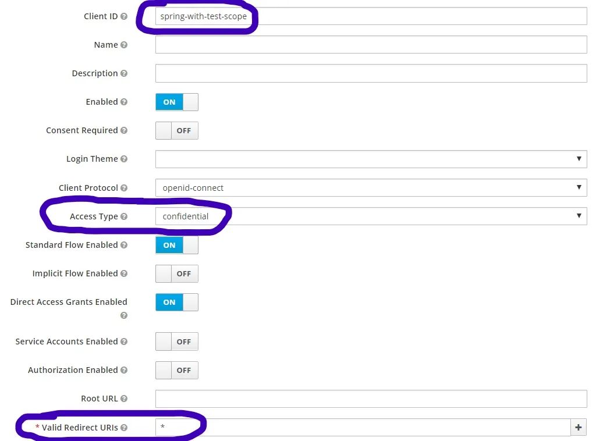
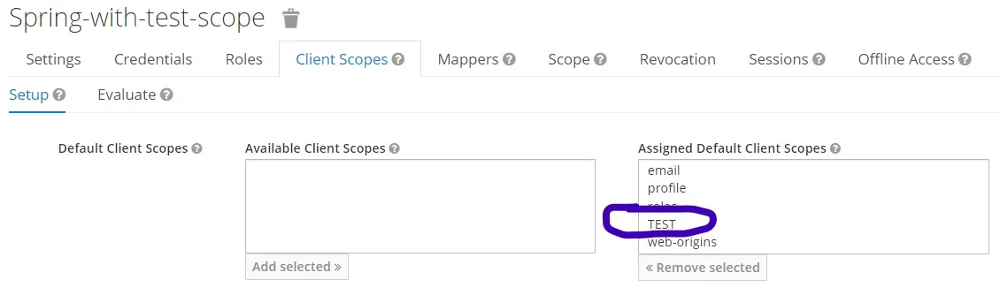

# Example Project for Security in Spring Boot and Microservices

1. How to renew certificates in your Spring Boot apps on Kubernetes with **Cert Manager** and **Stakater Reloader**. The example is available in the branch [master](https://github.com/piomin/sample-spring-microservices-new/tree/master).  A detailed guide may be find in the following article: [Renew Certificates on Kubernetes with Cert Manager and Reloader](https://piotrminkowski.com/2022/12/02/renew-certificates-on-kubernetes-with-cert-manager-and-reloader/) \
   A detailed instruction can also be found [here](https://github.com/piomin/sample-spring-security-microservices/tree/master/ssl)

* Article explaination keycloak configuration: https://piotrminkowski.com/2020/10/09/spring-cloud-gateway-oauth2-with-keycloak/
* key clock server docker : 
* docker run -d --name keycloak -p 8888:8080  -e KEYCLOAK_USER=spring  -e KEYCLOAK_PASSWORD=spring123 jboss/keycloak
* docker run -p 8080:8080 -e KEYCLOAK_ADMIN=admin -e KEYCLOAK_ADMIN_PASSWORD=admin quay.io/keycloak/keycloak:20.0.3 start-dev

* localhost:8060/login
* localhost:8060/token
* localhost:8060/callme/ping
* 
* 
